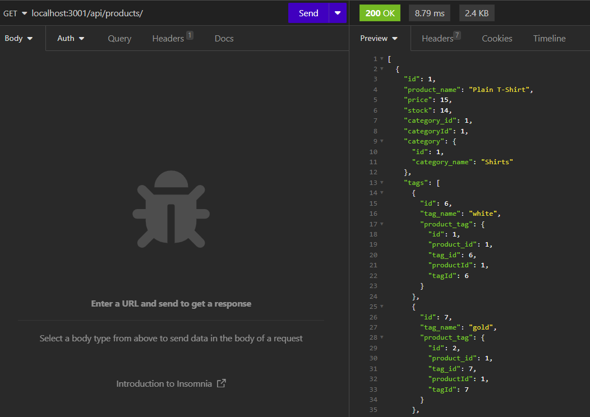
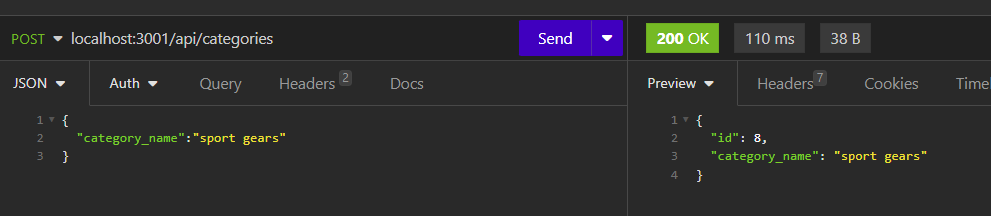

# E-commerce Backend System


## Description
    
A backend system for an e-commerce site using MySQL database. The database is made up of three main tables: Products, Categories and Tags.
Categories and Products have a one to many relationship while Products and Tags have a many to many relationship. A fourth table ProductTag is used to load the many to many association using Sequelize.
    
## Table of Contents
    
- [Installation](#installation)
- [Usage](#usage)
- [Credits](#credits)
- [License](#license)
- [How to Contribute](#how-to-contribute)
- [Tests](#tests)
    
## Installation
    
1. Clone this Git repo to your local directory.<br>
2. If you haven't already installed MySQL Server, you may need to [download](https://dev.mysql.com/) the relevant version and install this on your local machine first.
3. Open the repo folder in VS Studio or your preferred code editor.<br>
4. Open the Integrated Terminal and enter command `npm install` to download the required Inquirer package.<br>
5. Run ```mysql -u root -p``` command to connect to your local database and run ```source db/schema.sql``` to setup the schema for the database.
6. (Optional) Add sample data to your DB by running command ```npm run seed```.
7. Create a .env file in the root directory and include the following variables for connecting to your own local database server.
```
DB_NAME ='ecommerce_db'
DB_USER ='your username'
DB_PW ='your password'
```

## Usage
    
Once the dependencies and database schema have been installed and setup, you can invoke the application with command `npm start` in the terminal. You can then send API requests to the database using tools such as Insomnia. Example of Get request sent to local host is `localhost:3001/api/products/`. For more detailed instructions, please watch the [walkthrough video](https://drive.google.com/file/d/1FdLaYRAlj0h_uegDlThLZhibQLzBKmoD/view?usp=sharing).<br>




    
## Credits
NA

## License
<br>
This project is licensed under the MIT License - see the [LICENSE.md](license) file for details    
 
## How to Contribute
    
Feel free to contribute your ideas or bug fixes for this project by raising a new issue or new pull request.
    
## Tests
    
NA